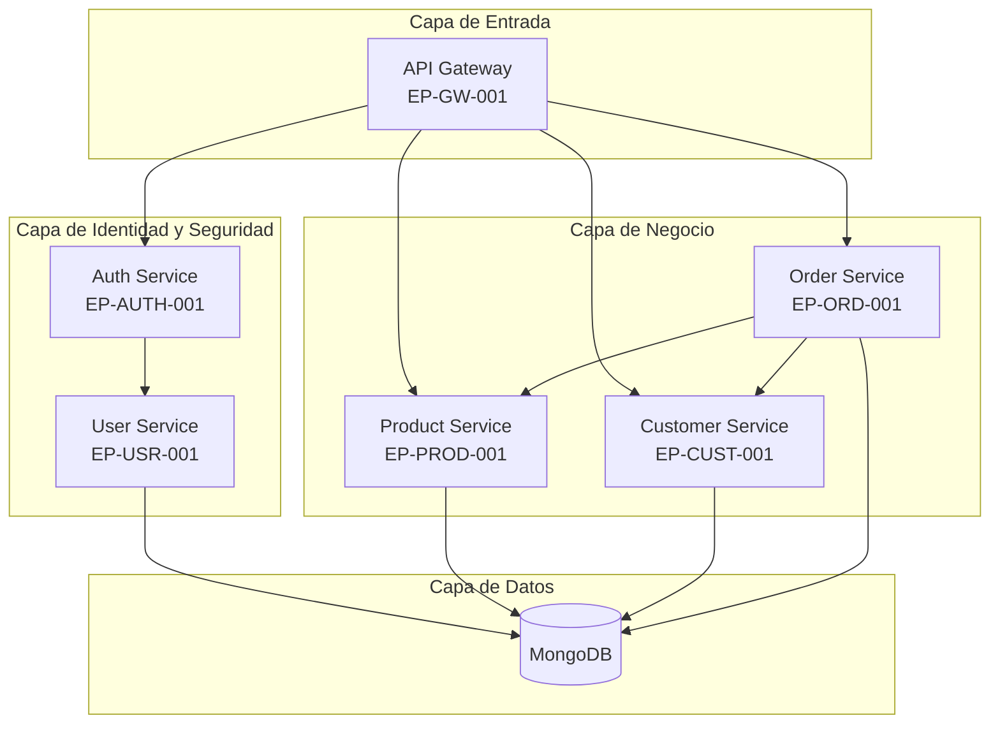
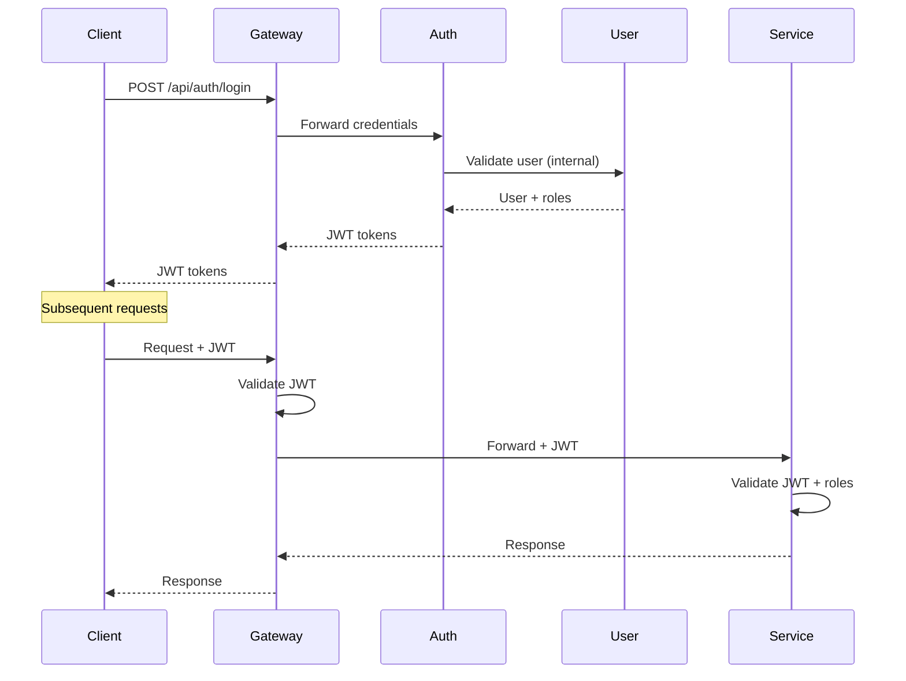

# Épica General - Nova Commerce Platform

## 📋 Información de la Épica Global

**Código:** EP-GLOBAL-001  
**Nombre:** Plataforma de E-commerce Modular y Escalable  
**Versión:** 1.0  
**Fecha de Creación:** Enero 2026  
**Estado:** En Desarrollo

---

## 🎯 Visión del Producto

**Nova Commerce** es una plataforma de e-commerce empresarial construida sobre una arquitectura de microservicios, diseñada para ofrecer escalabilidad, mantenibilidad y extensibilidad. El sistema permite gestionar el ciclo completo de comercio electrónico: desde la autenticación y gestión de usuarios, hasta el catálogo de productos, clientes y procesamiento de órdenes con motor de descuentos inteligente.

### Propuesta de Valor

- **Arquitectura Modular:** Cada microservicio es independiente y puede escalarse según demanda
- **Seguridad Robusta:** Autenticación JWT centralizada con propagación a través de API Gateway
- **Extensibilidad:** Aplicación de principios SOLID y patrones de diseño (Strategy, Ports & Adapters)
- **Operaciones Internas Seguras:** Comunicación entre servicios mediante API Keys internas
- **Motor de Descuentos:** Sistema flexible con estrategias configurables (lealtad, temporada, tipo de producto)

---

## 🏗️ Arquitectura General

### Componentes Principales

### Principios Arquitectónicos

- **Clean Architecture:** Separación de capas (dominio, aplicación, infraestructura)
- **SOLID:** Principios de diseño orientado a objetos en todos los componentes
- **Hexagonal Architecture:** Ports & Adapters para desacoplar lógica de negocio
- **API First:** Contratos definidos mediante OpenAPI/Swagger
- **Security by Design:** JWT + API Keys + validaciones en cada capa

---

## 📦 Épicas de Microservicios

### EP-GW-001: API Gateway - Enrutamiento y Seguridad Centralizada

**Objetivo:** Proveer un punto único de entrada para todos los servicios, manejando enrutamiento, validación preliminar y propagación de tokens JWT.

**Capacidades Clave:**
- Enrutamiento dinámico a microservicios backend
- Validación y propagación de tokens JWT
- Filtros de seguridad y logging
- Manejo centralizado de CORS

**Documentación:** [backend/nova-gateway/docs/HUS_GATEWAY_SERVICE.md](backend/nova-gateway/docs/HUS_GATEWAY_SERVICE.md)

**Puerto:** 8080

---

### EP-AUTH-001: Auth Service - Sistema de Autenticación y Autorización

**Objetivo:** Gestionar la autenticación de usuarios y emisión de tokens JWT para acceso a servicios protegidos.

**Capacidades Clave:**
- Login con credenciales (username/email + password)
- Emisión de Access Token (24h) y Refresh Token (7 días)
- Validación de tokens JWT
- Refresh de tokens expirados
- Integración con User Service para validación de credenciales

**Documentación:** [backend/auth-service/docs/HUS_AUTH_SERVICE.md](backend/auth-service/docs/HUS_AUTH_SERVICE.md)

**Puerto:** 8081

**Dependencias:**
- User Service (validación de credenciales)

---

### EP-USR-001: User Service - Gestión de Usuarios, Roles y Permisos

**Objetivo:** Administrar usuarios del sistema, sus roles y permisos, con validaciones de seguridad y unicidad.

**Capacidades Clave:**
- CRUD completo de usuarios
- Gestión de roles y permisos (RBAC)
- Validación de unicidad (username, email)
- Encriptación de contraseñas (BCrypt)
- Endpoints internos para validación de credenciales
- Consulta de usuarios por múltiples criterios

**Documentación:** [backend/user-service/docs/HUS_USER_SERVICE.md](backend/user-service/docs/HUS_USER_SERVICE.md)

**Puerto:** 8082

**Persistencia:** MongoDB

---

### EP-PROD-001: Product Service - Gestión de Catálogo de Productos y Categorías

**Objetivo:** Administrar el catálogo de productos, categorías y stock, con endpoints públicos e internos.

**Capacidades Clave:**
- CRUD de productos con validaciones de negocio
- Gestión de categorías y jerarquías
- Control de stock e inventario
- Consultas públicas paginadas
- Endpoints internos para validación de productos (precio, stock, tipo)
- Tipos de productos: STANDARD, SEASONAL, LUXURY

**Documentación:** [backend/product-service/docs/HUS_PRODUCT_SERVICE.md](backend/product-service/docs/HUS_PRODUCT_SERVICE.md)

**Puerto:** 8083

**Persistencia:** MongoDB

---

### EP-CUST-001: Customer Service - Gestión de Clientes y Programas de Lealtad

**Objetivo:** Administrar información de clientes, su estado y niveles de lealtad para aplicación de beneficios.

**Capacidades Clave:**
- CRUD de clientes con validaciones de negocio
- Gestión de niveles de lealtad (BRONZE, SILVER, GOLD, PLATINUM)
- Control de estatus de clientes (ACTIVE, INACTIVE, SUSPENDED)
- Validación de unicidad de email y documento
- Endpoints internos para consulta de información de clientes
- Historial de transacciones y puntos de fidelidad

**Documentación:** [backend/customer-service/docs/HU_CUSTOMER_SERVICE.md](backend/customer-service/docs/HU_CUSTOMER_SERVICE.md)

**Puerto:** 8084

**Persistencia:** MongoDB

---

### EP-ORD-001: Order Service - Procesamiento de Órdenes con Motor de Descuentos

**Objetivo:** Gestionar el ciclo de vida de órdenes de compra, aplicando descuentos inteligentes basados en estrategias configurables.

**Capacidades Clave:**
- Creación de órdenes con validación de clientes y productos
- Motor de descuentos con Strategy Pattern:
  - Descuento por lealtad del cliente (hasta 15%)
  - Descuento por tipo de producto (SEASONAL: 10%, LUXURY: 5%)
  - Descuento temporal/estacional configurable
- Validación de stock disponible
- Cálculo automático de totales y descuentos
- Consulta de órdenes por cliente
- Estados de orden: PENDING, CONFIRMED, SHIPPED, DELIVERED, CANCELLED

**Documentación:** [backend/order-service/docs/HUS_ORDER_SERVICE.md](backend/order-service/docs/HUS_ORDER_SERVICE.md)

**Puerto:** 8085

**Persistencia:** MongoDB

**Dependencias:**
- Customer Service (validación de cliente, nivel de lealtad)
- Product Service (validación de productos, precios, stock)

---

## 🔐 Modelo de Seguridad

### Autenticación y Autorización

### Comunicación Interna entre Servicios

- Endpoints `/internal/**` protegidos con header `X-Internal-API-Key`
- Permite comunicación segura entre microservicios sin exponer APIs al exterior
- Validación de API Key antes de procesar la solicitud

---

## 📊 Alcance del MVP

### Funcionalidades Implementadas ✅

- ✅ API Gateway con enrutamiento y propagación JWT
- ✅ Sistema de autenticación completo (login, refresh, validación)
- ✅ Gestión de usuarios, roles y permisos
- ✅ Catálogo de productos y categorías
- ✅ Gestión de clientes y niveles de lealtad
- ✅ Creación y consulta de órdenes
- ✅ Motor de descuentos con estrategias múltiples
- ✅ Endpoints internos seguros con API Keys
- ✅ Persistencia con MongoDB
- ✅ Documentación OpenAPI/Swagger por servicio

### Funcionalidades Futuras 🔮

- 🔮 Procesamiento de pagos (Payment Service)
- 🔮 Notificaciones (Notification Service)
- 🔮 Gestión de inventario avanzado
- 🔮 Reportes y analytics
- 🔮 Sistema de reseñas y valoraciones
- 🔮 Gestión de envíos y logística
- 🔮 Programa de puntos y recompensas

---

## 🧪 Estrategia de Testing

Cada microservicio implementa:

- **Tests Unitarios:** Lógica de dominio y casos de uso
- **Tests de Integración:** Comunicación con BD y servicios externos
- **Cobertura Mínima:** 80% (JaCoCo)
- **Validaciones:** Bean Validation (JSR-303) en capa de entrada

---

## 🚀 Despliegue

### Puertos de Microservicios

| Servicio | Puerto |
|----------|--------|
| API Gateway | 8080 |
| Auth Service | 8081 |
| User Service | 8082 |
| Product Service | 8083 |
| Customer Service | 8084 |
| Order Service | 8085 |

### Base de Datos

- **Motor:** MongoDB
- **Esquema:** Base de datos única (nova_db) con colecciones separadas por microservicio (aislamiento)

---

## 📚 Referencias

- [README General](README.md)
- [Documentación Técnica por Microservicio](README.md#documentación-por-microservicio)
- [Historias de Usuario por Microservicio](README.md#historias-de-usuario-por-microservicio)

---

## 📝 Glosario

- **JWT:** JSON Web Token - mecanismo de autenticación stateless
- **RBAC:** Role-Based Access Control - control de acceso basado en roles
- **Strategy Pattern:** Patrón de diseño que permite seleccionar algoritmos en tiempo de ejecución
- **Ports & Adapters:** Arquitectura hexagonal que separa lógica de negocio de detalles técnicos
- **API Key:** Clave de autenticación para comunicación interna entre servicios
- **MVP:** Minimum Viable Product - producto mínimo viable

---

**Última Actualización:** Enero 2026  
**Versión del Documento:** 1.0
