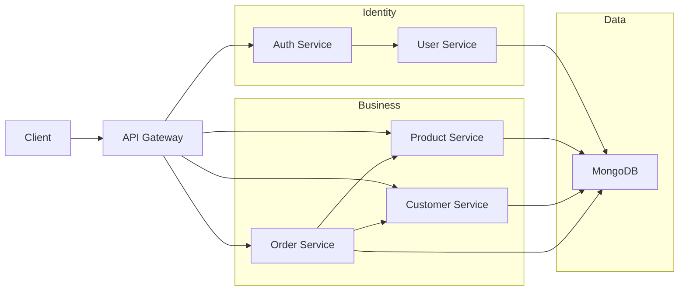
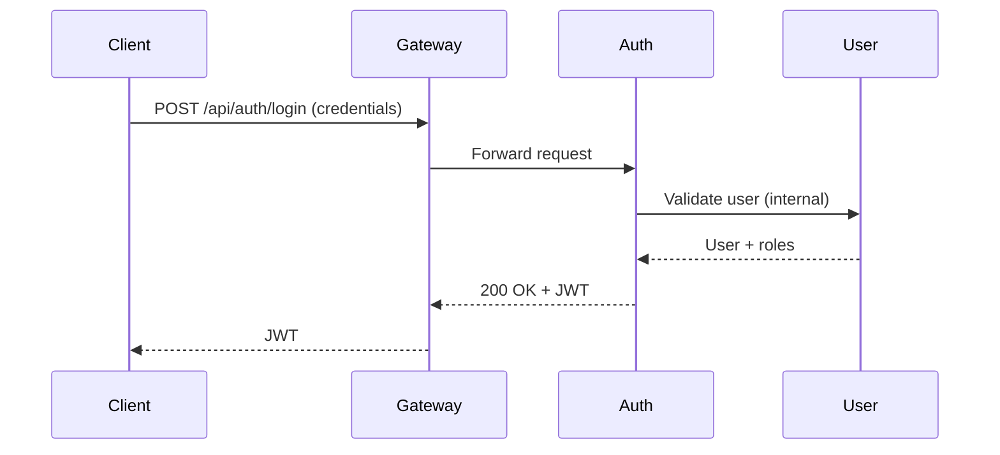
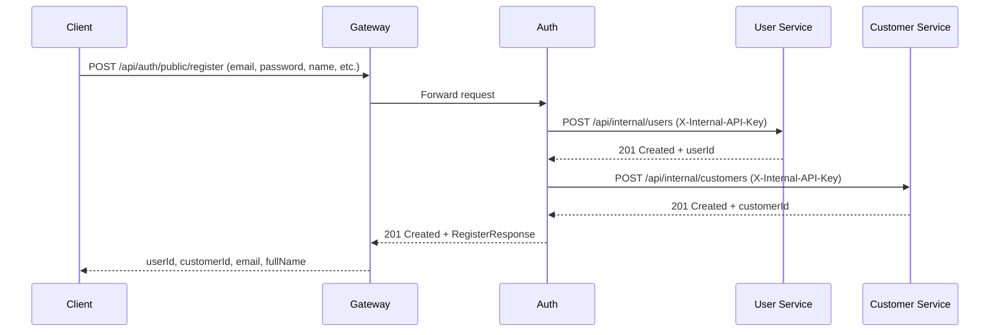
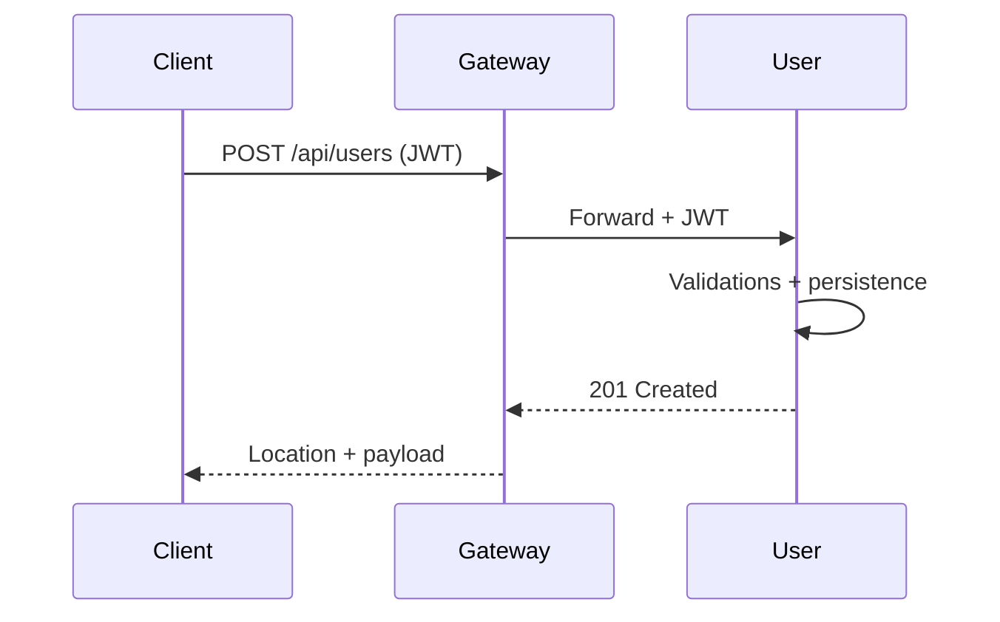
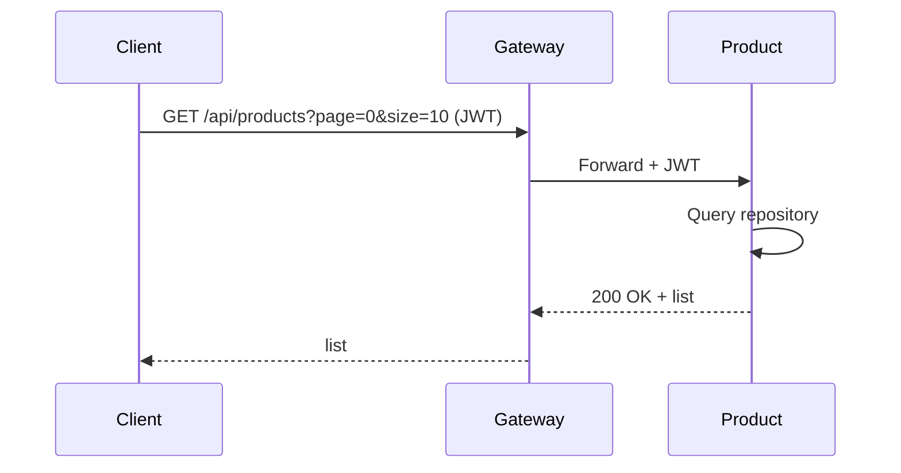
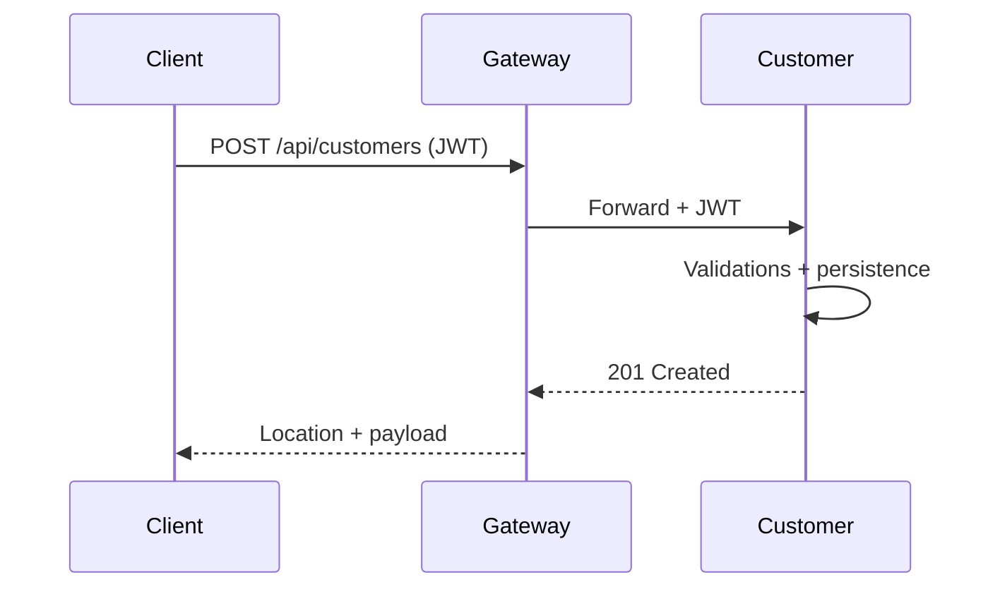
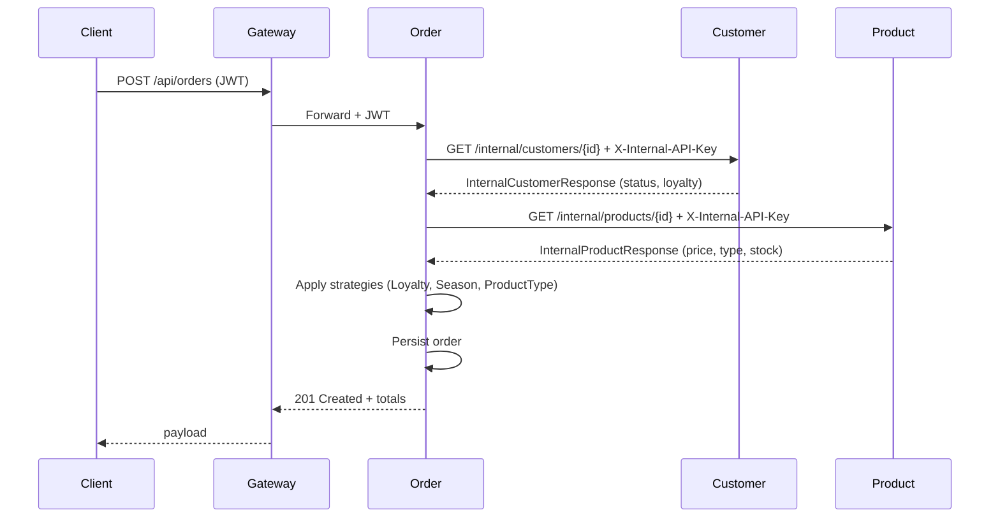

# Nova Commerce — README General

## Descripción General del Sistema

Plataforma de e-commerce modular basada en microservicios. El objetivo del proyecto es habilitar un sistema escalable, mantenible y fácilmente extensible, priorizando un MVP funcional con las capacidades esenciales de autenticación, usuarios, catálogo de productos, clientes y órdenes.

- Principios aplicados:
	- Clean Architecture
	- SOLID
	- Ports & Adapters (Hexagonal)
	- Enfoque DevOps y CI/CD (build reproducible, despliegue incremental)
	- MVP actual: funcionalidades clave sin sobredimensionar el alcance

## Arquitectura General

- API Gateway: Punto único de entrada; ruteo; validación preliminar y propagación de JWT.
- Auth Service: Autenticación; emisión de JWT; valida credenciales contra User Service.
- User Service: Gestión de usuarios, roles y permisos; persistencia en MongoDB.
- Product Service: Catálogo y categorías; endpoints públicos y `internal` protegidos por API Key.
- Customer Service: Gestión de clientes; endpoints públicos y `internal` protegidos por API Key.
- Order Service: Creación y consulta de órdenes; validación con Customer/Product vía Feign; descuentos con Strategy Pattern.

## 🧩 Microservicios y responsabilidades

| Servicio | Rol principal |
|--------|-------------|
| API Gateway | Enrutamiento + propagación JWT |
| Auth Service | Login, emisión y validación JWT |
| User Service | Usuarios, roles y permisos |
| Product Service | Catálogo y categorías |
| Customer Service | Gestión de clientes y fidelidad |
| Order Service | Creación de órdenes y descuentos |

Puertos (por defecto):
- Gateway 8080, Auth 8081, User 8082, Product 8083, Customer 8084, Order 8085

### Diagrama de Arquitectura (Mermaid)

Notas:
- Seguridad: JWT es validado en cada microservicio; endpoints internos (`/internal/**`) requieren `X-Internal-API-Key`.
- El gateway enruta y propaga el JWT; los servicios aplican su propia validación.

## Diagramas de Secuencia por Microservicio

### Auth Service — Login & Token Validation

### Auth Service — Registro Público de Cliente

### User Service — Creación de Usuario

### Product Service — Consulta de Productos

### Customer Service — Registro de Cliente

### Order Service — Creación de Orden con Descuentos

## Alcance del MVP Actual

- Implementado:
	- Rutas y seguridad via API Gateway
	- Autenticación JWT (Auth ↔ User)
	- Gestión de usuarios, productos, categorías y clientes
	- Creación/consulta de órdenes con motor de descuentos (Strategy Pattern)
	- Endpoints internos `/internal/**` con `X-Internal-API-Key`
	- Persistencia con MongoDB
	- OpenAPI/Swagger en cada servicio

- Escalabilidad por arquitectura:
	- Capas independientes (dominio/puertos/adaptadores)
	- Estrategias de descuento extensibles sin modificar código existente (OCP)
	- Integraciones via Feign desacopladas tras puertos
	- Posible despliegue/escala por servicio

## Reglas de Estilo del Documento

- Lenguaje técnico y claro; evitar párrafos largos.
- Usar tablas y diagramas donde aporten claridad.
- No repetir contenido ya detallado en los README de cada microservicio.
- Enlazar documentación específica según corresponda.

## Documentación por Microservicio

### Documentación Técnica (README)

- API Gateway: [backend/nova-gateway/README-API-GATEWAY.md](backend/nova-gateway/README-API-GATEWAY.md)
- Auth Service: [backend/auth-service/README-AUTH-SERVICE.md](backend/auth-service/README-AUTH-SERVICE.md)
- User Service: [backend/user-service/README-USER-SERVICE.md](backend/user-service/README-USER-SERVICE.md)
- Product Service: [backend/product-service/README-product-service.md](backend/product-service/README-product-service.md)
- Customer Service: [backend/customer-service/README-customer-service.md](backend/customer-service/README-customer-service.md)
- Order Service: [backend/order-service/README-order-service.md](backend/order-service/README-order-service.md)

### Historias de Usuario por Microservicio

- **Épica Global**: [HUS_NOVA_PLATFORM.md](HUS_NOVA_PLATFORM.md)
- API Gateway: [backend/nova-gateway/docs/HUS_GATEWAY_SERVICE.md](backend/nova-gateway/docs/HUS_GATEWAY_SERVICE.md)
- Auth Service: [backend/auth-service/docs/HUS_AUTH_SERVICE.md](backend/auth-service/docs/HUS_AUTH_SERVICE.md)
- User Service: [backend/user-service/docs/HUS_USER_SERVICE.md](backend/user-service/docs/HUS_USER_SERVICE.md)
- Product Service: [backend/product-service/docs/HUS_PRODUCT_SERVICE.md](backend/product-service/docs/HUS_PRODUCT_SERVICE.md)
- Customer Service: [backend/customer-service/docs/HU_CUSTOMER_SERVICE.md](backend/customer-service/docs/HU_CUSTOMER_SERVICE.md)
- Order Service: [backend/order-service/docs/HUS_ORDER_SERVICE.md](backend/order-service/docs/HUS_ORDER_SERVICE.md)
